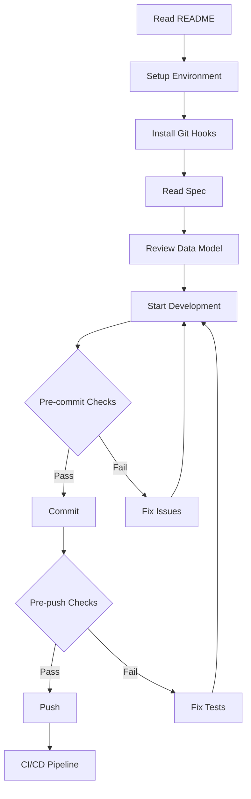

# Documentation Index

Welcome to the Telegram Cash Flow Bot documentation!

## 📚 Available Documentation

### Getting Started

- [README.md](../README.md) - Project overview and quick start
- [quickstart.md](../../specs/001-cashflow-bot/quickstart.md) - Development environment setup

### Git Hooks & Quality Assurance

- **[HOOKS_QUICKSTART.md](HOOKS_QUICKSTART.md)** ⭐ - Quick setup guide (5 minutes)
- **[HOOKS.md](HOOKS.md)** - Complete hooks reference and troubleshooting
- **[HOOKS_IMPLEMENTATION_SUMMARY.md](HOOKS_IMPLEMENTATION_SUMMARY.md)** - Implementation details and technical summary

### Architecture & Design

- [spec.md](../../specs/001-cashflow-bot/spec.md) - Functional requirements and user stories
- [plan.md](../../specs/001-cashflow-bot/plan.md) - Implementation plan and technical architecture
- [data-model.md](../../specs/001-cashflow-bot/data-model.md) - Database schema and relationships

### Development

- [research.md](../../specs/001-cashflow-bot/research.md) - Technology decisions and best practices
- [tasks.md](../../specs/001-cashflow-bot/tasks.md) - Development task breakdown

## 🎯 Quick Navigation

### For New Developers

1. Start with [README.md](../README.md)
2. Follow [quickstart.md](../../specs/001-cashflow-bot/quickstart.md)
3. Install hooks via [HOOKS_QUICKSTART.md](HOOKS_QUICKSTART.md)
4. Read [spec.md](../../specs/001-cashflow-bot/spec.md) for requirements

### For Contributing

1. Review [HOOKS.md](HOOKS.md) for quality standards
2. Check [plan.md](../../specs/001-cashflow-bot/plan.md) for architecture
3. Read [data-model.md](../../specs/001-cashflow-bot/data-model.md) for database schema
4. Follow conventional commits format (enforced by hooks)

### For Deployment

1. Run `make preflight` or `./scripts/preflight.sh`
2. Check [README.md - Deployment](../README.md#deployment) section
3. Review [spec.md - Non-Functional Requirements](../../specs/001-cashflow-bot/spec.md#non-functional-requirements)

## 📖 Documentation by Topic

### Quality Assurance

| Topic | Document | Description |
|-------|----------|-------------|
| Quick Setup | [HOOKS_QUICKSTART.md](HOOKS_QUICKSTART.md) | 5-minute hook installation |
| Complete Reference | [HOOKS.md](HOOKS.md) | All hooks, configs, troubleshooting |
| Implementation Details | [HOOKS_IMPLEMENTATION_SUMMARY.md](HOOKS_IMPLEMENTATION_SUMMARY.md) | Technical implementation summary |

### Project Management

| Topic | Document | Description |
|-------|----------|-------------|
| Requirements | [spec.md](../../specs/001-cashflow-bot/spec.md) | Functional & non-functional requirements |
| Planning | [plan.md](../../specs/001-cashflow-bot/plan.md) | Implementation phases & architecture |
| Tasks | [tasks.md](../../specs/001-cashflow-bot/tasks.md) | Task breakdown with dependencies |

### Technical Design

| Topic | Document | Description |
|-------|----------|-------------|
| Database | [data-model.md](../../specs/001-cashflow-bot/data-model.md) | Schema, indexes, relationships |
| Research | [research.md](../../specs/001-cashflow-bot/research.md) | Technology decisions & benchmarks |
| Architecture | [plan.md](../../specs/001-cashflow-bot/plan.md) | Layered architecture design |

## 🛠️ Development Workflow

## 🔍 Finding Information

### I want to

- **Get started quickly** → [README.md](../README.md)
- **Understand project requirements** → [spec.md](../../specs/001-cashflow-bot/spec.md)
- **Install Git hooks** → [HOOKS_QUICKSTART.md](HOOKS_QUICKSTART.md)
- **Troubleshoot hook issues** → [HOOKS.md](HOOKS.md)
- **Understand the database** → [data-model.md](../../specs/001-cashflow-bot/data-model.md)
- **See implementation plan** → [plan.md](../../specs/001-cashflow-bot/plan.md)
- **Deploy to production** → [README.md - Deployment](../README.md#deployment)
- **Contribute to the project** → Start with [HOOKS.md](HOOKS.md) + [spec.md](../../specs/001-cashflow-bot/spec.md)

## 📊 Documentation Statistics

| Category | Files | Total Lines |
|----------|-------|-------------|
| Git Hooks Docs | 3 | 819 |
| Hook Configs | 5 | ~300 |
| Hook Scripts | 6 | 488 |
| Specifications | 6 | ~3,000 |
| **Total** | **20** | **~4,600** |

## 🔗 External Resources

- [Pre-commit Documentation](https://pre-commit.com/)
- [Conventional Commits](https://www.conventionalcommits.org/)
- [Python-telegram-bot](https://docs.python-telegram-bot.org/)
- [SQLAlchemy 2.0](https://docs.sqlalchemy.org/en/20/)
- [Alembic](https://alembic.sqlalchemy.org/)

## 💡 Pro Tips

1. **Bookmark this page** - Quick access to all documentation
2. **Start with HOOKS_QUICKSTART.md** - Get productive immediately
3. **Use `make help`** - See all available commands
4. **Read error messages** - Hooks provide clear guidance
5. **Ask before bypassing hooks** - They catch real bugs!

---

**Last Updated**: December 18, 2025  
**Maintained By**: Development Team  
**Questions?** Check [HOOKS.md](HOOKS.md) troubleshooting section
